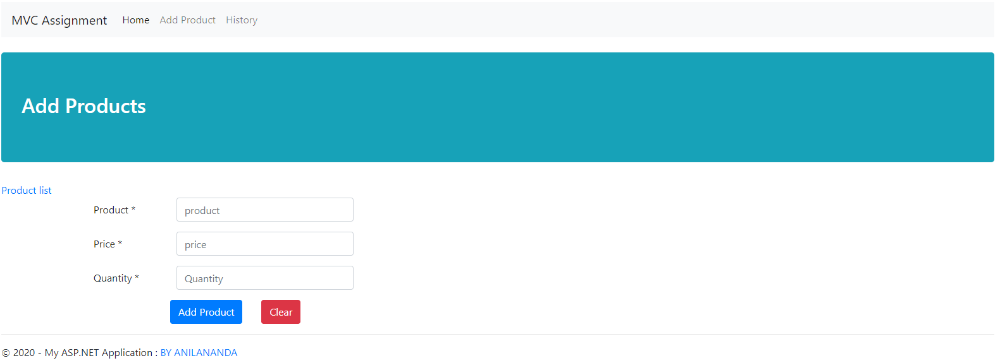
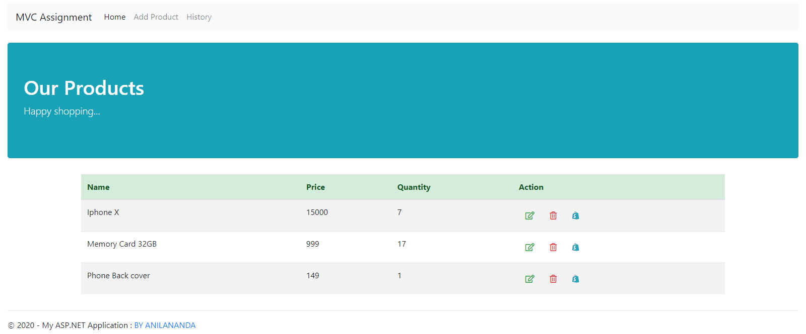
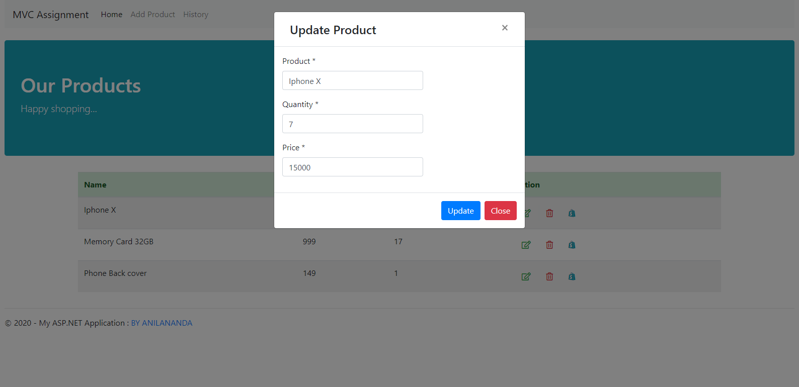
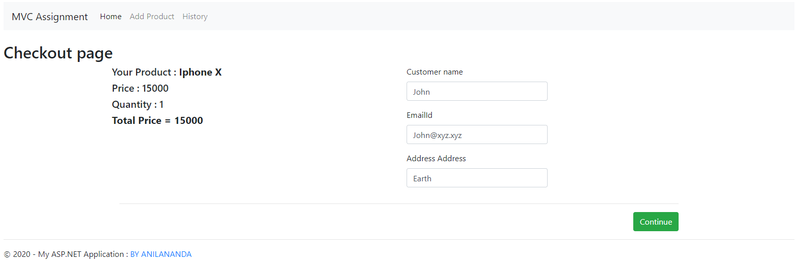
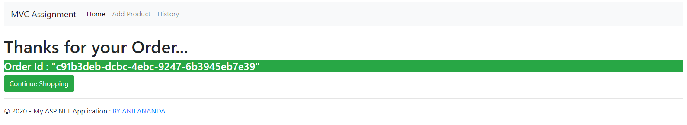
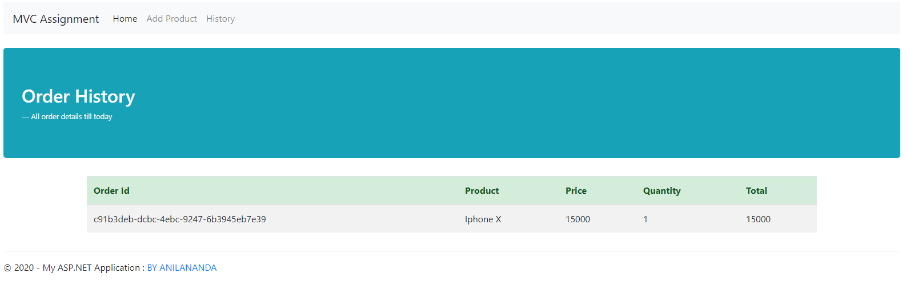

# MvcAssignment
Complete CRUD Operation In MVC with code first migration...

Change the connection string and update-database.

This is the form for adding product detail

Details List of the products if the product have 0 stock then it will give the message out of stock

Here is a popup for update

checkout page

